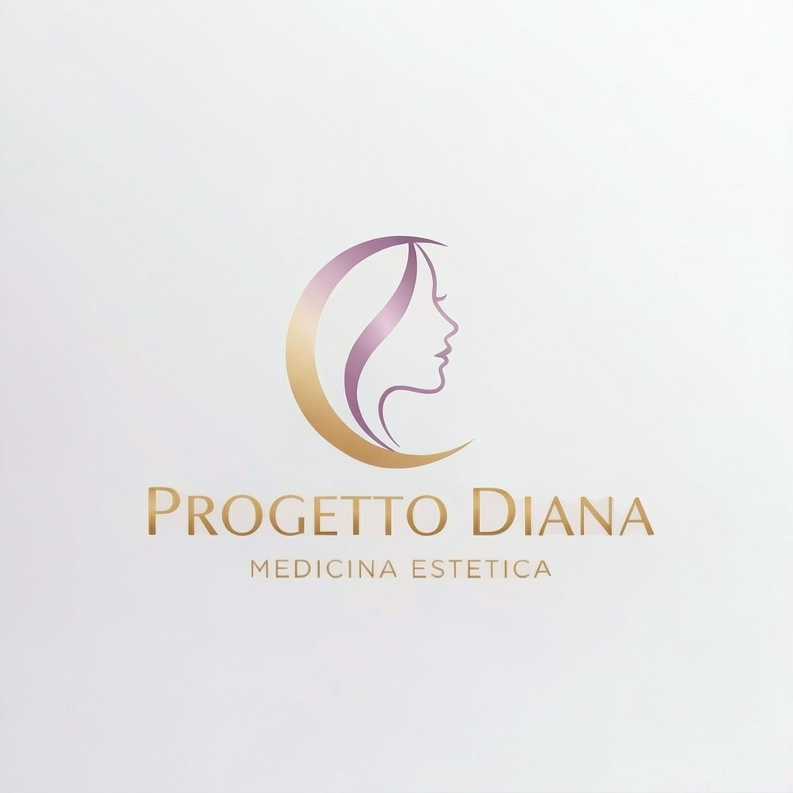

<div align="center">



# Progetto Diana — Medicina Estetica

*Bellezza consapevole. Risultati naturali. Tecnologia avanzata.*

<br>

[](https://cammo22.github.io/ProgettoDiana/)

</div>

---

## Panoramica

**Progetto Diana** è il sito web ufficiale dell'omonimo centro di medicina estetica e bellezza. La pagina è stata progettata con un'identità visiva luxury — palette oro e lilla ispirata al logo — per riflettere l'eccellenza dei servizi offerti.

Il sito è una **single-page application statica**, completamente compatibile con **GitHub Pages**, senza dipendenze da framework o build tool.

---

## Struttura del Sito

| Sezione | Descrizione |
|---|---|
| **Hero** | Video loop del logo come sfondo full-screen con overlay sfumato |
| **Chi Siamo** | Filosofia del centro, valori chiave e badge di certificazione |
| **Statistiche** | Contatori animati: clienti, trattamenti, soddisfazione, esperienza |
| **Servizi** | 4 categorie con schede interattive espandibili al click |
| **Tecnologie** | Elenco delle 8 apparecchiature di ultima generazione utilizzate |
| **Il Metodo** | Processo in 4 fasi: Consulenza → Diagnosi → Trattamento → Follow-up |
| **Risultati** | Galleria before/after con filtri per categoria (pronta per foto reali) |
| **Testimonianze** | Recensioni verificate con rating 4.9/5 stelle |
| **FAQ** | 6 domande frequenti in formato accordion interattivo |
| **Team** | Presentazione delle professioniste con specializzazioni |
| **Prenota** | Form di contatto con selezione trattamento e animazione di conferma |
| **Footer** | Navigazione, orari, social e note legali |

---

## Servizi Inclusi

<details>
<summary><strong>💉 Medicina Estetica</strong></summary>

- Tossina Botulinica (Botox) — rughe, lifting sopracciglia, iperidrosi, bruxismo
- Filler con Acido Ialuronico — labbra, zigomi, rhinofiller, occhiaie, ovale
- Biorivitalizzazione & Skinbooster — Profhilo, Juvederm Volite
- PRP — Plasma Ricco di Piastrine — viso e tricologia
- Fili Tensori PDO — lifting non chirurgico
- Mesoterapia — viso, capelli, corpo
- Peeling Chimici — superficiali e medi
- Carbossiterapia — cellulite, occhiaie, rassodamento

</details>

<details>
<summary><strong>✨ Laser & Tecnologie</strong></summary>

- Laser Diodo 808nm — depilazione permanente
- HIFU 7D — lifting non invasivo viso e corpo
- Radiofrequenza Multipolare — rassodamento
- Criolipolisi — eliminazione adiposità (fino al -27%)
- Cavitazione Ultrasonica 40KHz — anticellulite
- IPL Luce Pulsata — macchie, couperose, foto-ringiovanimento
- LED Therapy — anti-age, acne, calmante
- Microneedling RF — rinnovamento cutaneo

</details>

<details>
<summary><strong>🌸 Centro Estetico</strong></summary>

- Trattamenti Viso personalizzati (pulizia, idratazione, anti-age, acne)
- Trucco Semipermanente (PMU): Microblading, Powder Brow, Blush Lips, Eye Liner
- Extension Ciglia & Lash Lift
- Laminazione e Henna Sopracciglia
- Nail Care: manicure, pedicure, semipermanente, ricostruzione, nail art
- Epilazione (ceretta italiana e orientale)

</details>

<details>
<summary><strong>🧘 Corpo & Benessere</strong></summary>

- Massaggi: rilassante, decontratturante, drenaggio linfatico, Hot Stone, anticellulite
- Trattamenti corpo: scrub, fanghi termali, bendaggi snellenti, wrap
- Abbronzatura spray airbrush
- Percorsi personalizzati su misura

</details>

---

## Stack Tecnico

```
HTML5 · CSS3 · Vanilla JavaScript
```

- **Zero dipendenze** da framework CSS o JS
- **Google Fonts** via CDN (Playfair Display + Inter)
- Animazioni CSS con `@keyframes` e `IntersectionObserver`
- Layout responsive con CSS Grid e Flexbox
- Compatibile con tutti i browser moderni

---

## Palette Colori

| Nome | Hex | Uso |
|---|---|---|
| Oro primario | `#C9A052` | Accenti, CTA, decorazioni |
| Oro chiaro | `#E8D5A3` | Gradienti, hover |
| Lilla | `#9B7FBD` | Icone, dettagli, gradienti |
| Lilla chiaro | `#D4C5E8` | Sfondi card, avatar |
| Scuro | `#1C1C1C` | Testo principale, sfondi dark |
| Crema | `#FAF7F2` | Sfondo principale |

---

## File del Progetto

```
ProgettoDiana/
├── index.html        # Pagina principale (single-page)
├── logo.jpg          # Logo ufficiale
├── logo-loop.mp4     # Video loop per la hero section
└── README.md         # Questo file
```

---

## Pubblicazione su GitHub Pages

1. Crea un repository su GitHub (es. `ProgettoDiana`)
2. Carica i file: `index.html`, `logo.jpg`, `logo-loop.mp4`
3. Vai su **Settings → Pages**
4. Imposta **Source** su `Deploy from a branch` → `main` → `/ (root)`
5. Salva — il sito è live su [https://cammo22.github.io/ProgettoDiana/](https://cammo22.github.io/ProgettoDiana/)

---

<div align="center">

*© 2026 Progetto Diana — Medicina Estetica*

</div>
