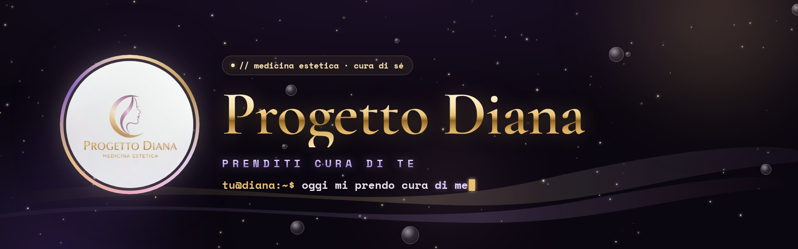
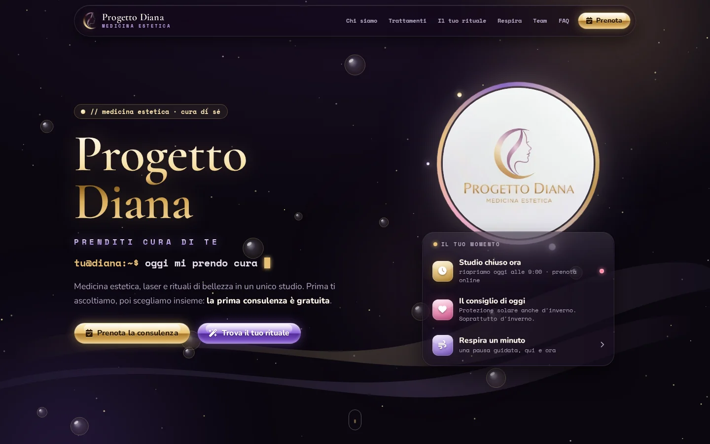
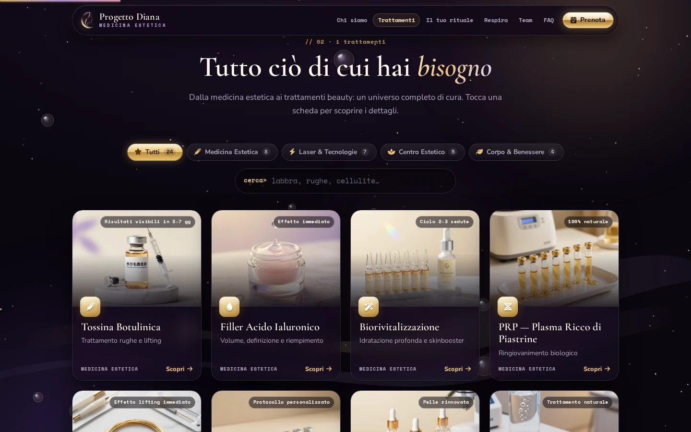
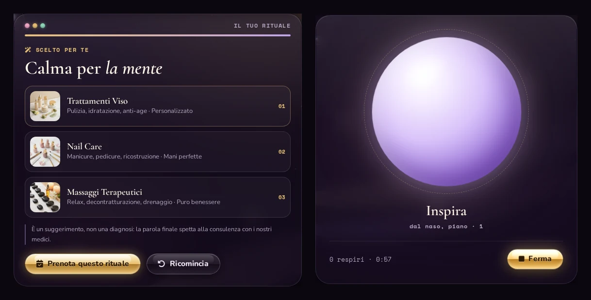
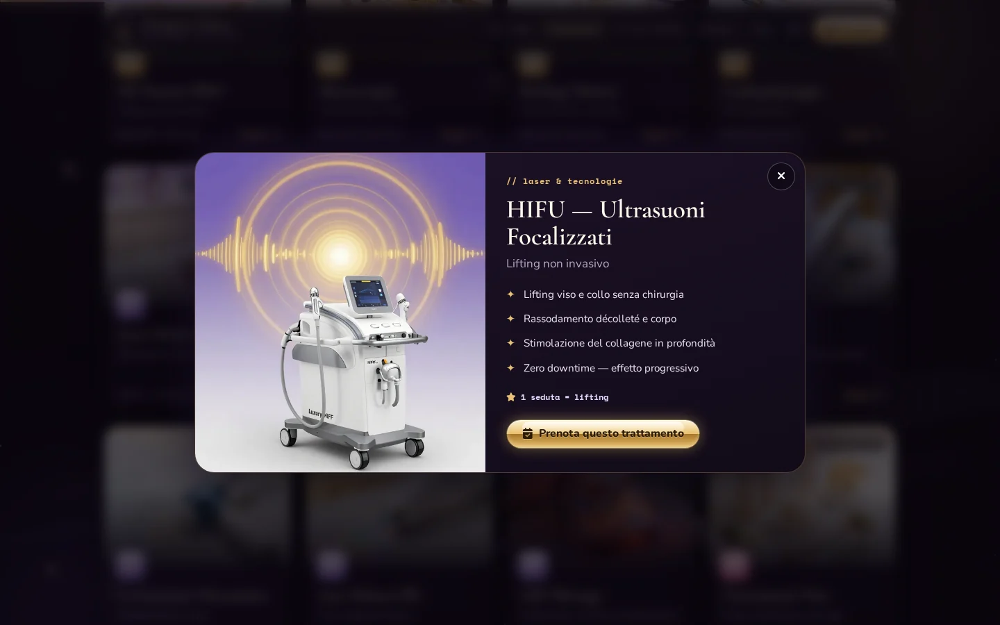
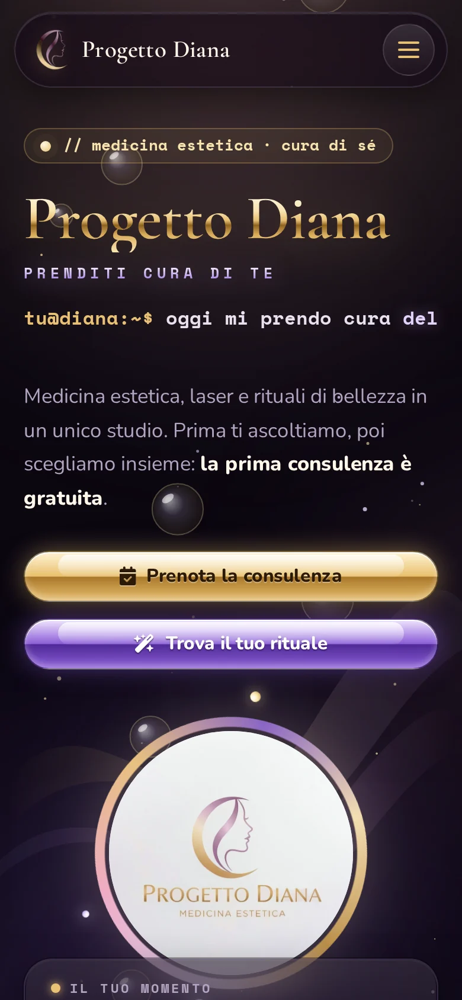

<div align="center">

<a href="https://cammo22.github.io/ProgettoDiana/"></a>

<br><br>

[](https://cammo22.github.io/ProgettoDiana/)

[](https://cammo22.github.io/ProgettoDiana/)
[](index.html)
[](#-leggero-e-rispettoso)
[](#-leggero-e-rispettoso)

**[🌐 Sito](https://cammo22.github.io/ProgettoDiana/)** ·
**[✨ Trova il tuo rituale](https://cammo22.github.io/ProgettoDiana/#rituale)** ·
**[🌬️ Respira un minuto](https://cammo22.github.io/ProgettoDiana/#respira)** ·
**[📅 Prenota](https://cammo22.github.io/ProgettoDiana/#prenota)**

</div>

---

```
tu@diana:~$ oggi mi prendo cura di me
Progetto Diana — medicina estetica, laser e rituali di bellezza in un unico studio.
Prima ti ascoltiamo, poi scegliamo insieme. La prima consulenza è gratuita.
```

Questo è il sito di **Progetto Diana**: una spa notturna in oro e lilla, con lo specchio-luna
che brilla al centro (Diana è la dea della luna), polvere d'oro che sale piano e perle che
galleggiano. Non è solo una vetrina: ti fa scegliere il trattamento giusto, ti fa respirare
e ti prepara il messaggio per prenotare.

<div align="center">
<a href="https://cammo22.github.io/ProgettoDiana/"></a>
</div>

## ✨ Cosa trovi nel sito

| | Sezione | Cosa fa |
|:-:|---|---|
| 🌙 | **Lo specchio-luna** | Il logo animato dentro uno specchio rotondo con la cornice d'oro che gira. È la prima cosa che vedi. |
| 🟢 | **Il tuo momento** | Sa se lo studio è **aperto adesso** (ora di Roma) e quando riapre, e ogni giorno ti lascia un **consiglio di cura** diverso. |
| 💎 | **Trattamenti** | 24 schede in 4 aree, con **ricerca istantanea** ("labbra", "rughe", "cellulite"…) e una scheda di dettaglio che ti porta dritta alla prenotazione. |
| 🪄 | **Trova il tuo rituale** | Tre domande, venti secondi: il sito ti propone i tre trattamenti più vicini a quello che cerchi. Nessun dato richiesto. |
| 🌬️ | **Respira** | Un minuto di respiro guidato: la perla si gonfia e si sgonfia col ritmo che scegli (Calma, Quadrato, Sonno). La cura di sé comincia qui, ed è gratis. |
| 🧭 | **Il metodo** | Consulenza → Diagnosi → Trattamento → Follow-up, con la linea d'oro che si disegna mentre scorri. |
| 📅 | **Prenota** | Il modulo prepara il messaggio e lo manda **su WhatsApp o per email** con un tocco. Se vuoi, anche via Formspree. |

<div align="center">

</div>

## 🪄 Il rituale e il respiro

Le due parti più "DaProd" del sito: piccoli strumenti che si usano davvero, non solo testo da leggere.

<div align="center">

</div>

Il quiz non è una diagnosi e lo dice chiaramente: suggerisce, poi decide la consulenza.
Quando premi **Prenota questo rituale**, il modulo si compila da solo con il trattamento e
una nota su cosa hai scelto.

<div align="center">

</div>

## 📱 Dal telefono



Pensato prima di tutto per il telefono:

- menu a tendina nella capsula in alto, categorie che scorrono col dito
- bottoni grandi, recensioni a carosello, modulo a una colonna
- nessuno scroll orizzontale, verificato a 390 px
- chi ha attivato **"riduci movimento"** nel telefono vede tutto fermo e tranquillo

Piccola sorpresa: dal computer, scrivi **`luna`** in un punto qualsiasi della pagina.

<br clear="right">

## ⚡ Leggero e rispettoso

| | Prima | Adesso |
|---|---|---|
| Immagini | 45 PNG, **59 MB**, tutte caricate subito | WebP ottimizzati, **1,3 MB**, caricati solo quando servono |
| Icone | emoji | Font Awesome ridotto alle 56 icone usate: **7 KB** |
| Font | da Google Fonts | ospitati qui: nessuna richiesta a server esterni (meglio per il GDPR) |
| Contatti e orari | sparsi nell'HTML | in un solo file, [`js/dati.js`](js/dati.js) |
| Pagina non trovata | quella di GitHub | una [404](404.html) in stile: *"questa pagina si è presa un giorno di relax"* |

In più: anteprima curata quando condividi il link (WhatsApp, Instagram, Facebook), favicon con
l'emblema, navigazione da tastiera, contrasti leggibili sul fondo scuro.

## 💎 I trattamenti

<details>
<summary><strong>💉 Medicina Estetica</strong> — 8 trattamenti</summary>

Tossina Botulinica · Filler Acido Ialuronico · Biorivitalizzazione · PRP — Plasma Ricco di Piastrine ·
Fili Tensori PDO · Mesoterapia · Peeling Chimici · Carbossiterapia

</details>

<details>
<summary><strong>⚡ Laser & Tecnologie</strong> — 7 trattamenti</summary>

Laser Diodo 808nm · HIFU — Ultrasuoni Focalizzati · Radiofrequenza Multipolare · Criolipolisi ·
Cavitazione Ultrasonica · Luce Pulsata IPL · LED Therapy

</details>

<details>
<summary><strong>🌸 Centro Estetico</strong> — 5 trattamenti</summary>

Trattamenti Viso · Trucco Semipermanente · Ciglia & Sopracciglia · Nail Care · Epilazione

</details>

<details>
<summary><strong>🧘 Corpo & Benessere</strong> — 4 trattamenti</summary>

Massaggi Terapeutici · Trattamenti Corpo · Abbronzatura Spray · Percorsi Personalizzati

</details>

## 🎨 Identità

| | Colore | Uso |
|:-:|---|---|
| 🟫 | `#0b0710` notte | fondo della pagina |
| 🟨 | `#e8c074` oro | titoli, bottoni, accenti |
| 🟪 | `#bfa2ea` lilla | sottotitoli, perle, dettagli |
| 🩷 | `#f2a7c3` rosa | icone, cuore, sfumature |
| 🟩 | `#8fd8b8` salvia | benessere, "aperto ora" |

**Cormorant Garamond** per i titoli, **Nunito** per il testo, **Space Mono** per il prompt e le etichette.
Lo stile è quello di [DaProd](https://cammo22.github.io/Portfolio/): vetro scuro, bottoni lucidi,
prompt da terminale. Qui però invece della pioggia matrix c'è la polvere d'oro.

---

## Com'è fatto il sito

HTML, CSS e JavaScript scritti a mano: niente framework, niente build, niente CDN.

```
index.html            la pagina
404.html              la pagina "in relax"
css/style.css         lo stile: vetro scuro, oro e lilla, bottoni perla
css/font.css          i font, ospitati in fonts/
css/icone.css         le icone usate (generato da strumenti/icone.py)
js/dati.js            ← contatti, orari, social e tutti i trattamenti
js/app.js             stato dello studio, quiz, respiro, ricerca, schede, modulo, effetti
immagini/web/         le foto ottimizzate usate dal sito (WebP)
immagini/*.png        gli originali, per ogni futura modifica
img/                  logo scontornato, emblema, favicon, immagini del README
strumenti/icone.py    rigenera le icone quando ne aggiungi una
```

**Cambiare contatti, orari o trattamenti:** tutto in [`js/dati.js`](js/dati.js). Menu, schede,
ricerca, quiz, stato "aperto ora" e modulo si aggiornano da soli.
La guida completa, passo per passo, è in [`SITE_DOCS.md`](SITE_DOCS.md).

**Provarlo in locale**

```bash
git clone https://github.com/cammo22/ProgettoDiana.git
cd ProgettoDiana
python3 -m http.server 8000   # poi apri http://localhost:8000
```

**Pubblicazione:** GitHub Pages pubblica il ramo `main` dalla radice del repository.
Ogni push su `main` aggiorna il sito in un paio di minuti.

<div align="center">
<br>

[](https://cammo22.github.io/ProgettoDiana/)

<sub>© Progetto Diana — Medicina Estetica · sito fatto a mano da <a href="https://cammo22.github.io/Portfolio/">DaProd</a></sub>

</div>
